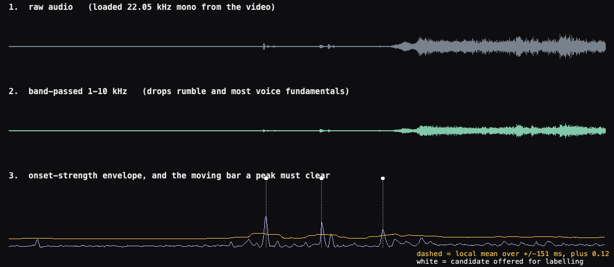
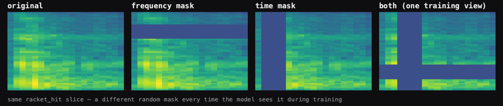

# Onset Detection for Annotation Candidate Generation

*Draft methods text for the dissertation. Every figure quoted below was
measured on the corpus as it stood in August 2026 and should be re-verified
before submission if the corpus has grown.*

*Implementation: `annotator.compute_envelope` and `annotator.pick_candidates`,
with the band-pass in `analyzer.bandpass`.*

---

## Purpose

Manual annotation of a full-length match is impractical if the annotator must
locate every event by scanning the recording. The annotation tool therefore
employs a signal-processing front end that proposes candidate time points,
which the annotator subsequently classifies or rejects. This separates
detection — identifying acoustically salient instants — from classification,
which remains a human judgement. Annotation effort then scales with the number
of genuine events rather than with recording duration.

The front end is tuned for recall rather than precision. A missed onset is
never presented for labelling and is therefore lost from the corpus, whereas a
spurious one costs only a keystroke to dismiss. This inverts the criterion used
by the same detector elsewhere in the system, where a false positive produces
an unwanted haptic pulse and precision is accordingly favoured.

## Signal preparation

Audio is decoded from the source video to 22.05 kHz mono. A fourth-order
Butterworth band-pass of 1–10 kHz is then applied in a zero-phase
configuration (forward–backward filtering, `scipy.signal.sosfiltfilt`).

Zero-phase filtering is necessary rather than merely convenient: the annotation
timestamps are used directly to crop the fixed-length excerpts from which
training features are computed, so any frequency-dependent group delay would
displace onsets by an unknown amount and misalign every excerpt.

The pass band was selected empirically. Widening the lower edge to 200 Hz
*reduced* the candidate count at a fixed threshold (174 against 204 on a
representative match) rather than increasing it, because the detection function
is normalised by its own maximum; admitting low-frequency crowd energy raises
that maximum and suppresses all peaks relative to it.

## Detection function

Onset strength is computed as spectral flux (`librosa.onset.onset_strength`):
a mel spectrogram is formed, the first difference along time is half-wave
rectified, and the result is summed across mel bands. The hop size is 256
samples, giving a frame rate of 11.6 ms.

Because only positive spectral change contributes, the function responds to
increases in energy and is largely insensitive to sustained sound irrespective
of its level. Crowd noise and commentary consequently produce little response,
while impulsive events produce sharp isolated peaks. The resulting function is
divided by its maximum over the recording and clipped to [0, 1], so threshold
values are expressed relative to the strongest onset present in that recording.

## Adaptive peak picking

Candidates are extracted with `librosa.util.peak_pick`. A frame *n* is accepted
as a candidate if and only if all three conditions hold:

1. `env[n] = max(env[n − w : n + w])` — the frame is a local maximum;
2. `env[n] ≥ mean(env[n − w : n + w]) + δ` — it exceeds the local mean by at
   least δ;
3. `n − n_prev > w` — at least *w* frames have elapsed since the previous
   accepted candidate,

with *w* = 13 frames (151 ms) and δ = 0.12.

Condition (2) is the substantive one. δ is not an absolute level but the margin
by which a peak must rise above its immediate neighbourhood, so the effective
decision boundary tracks the local background. During a quiet passage the
boundary falls and a modest impact qualifies; during applause it rises with the
surrounding energy and the same impact does not. This adaptivity is what allows
a single parameter setting to hold across a complete broadcast recording, in
which background level varies by tens of decibels.

## Parameter selection

**Threshold (δ = 0.12).** Candidate quality was assessed by measuring, for each
candidate, the prominence of its peak — the detection-function value minus the
median over a ±0.5 s neighbourhood. At δ = 0.08 approximately 12% of candidates
had prominence below 0.10 and could not reliably be identified by ear, making
them unusable for annotation; at δ = 0.12 none fell below that value, at a cost
of roughly one third of the candidate count. Since the corpus already yields
substantially more candidates than the target annotation volume, the exchange
of quantity for reliability was accepted.

**Minimum spacing (w = 151 ms).** This is set equal to the 150 ms excerpt
duration used for feature extraction, which guarantees that no two candidates
can produce overlapping training excerpts. The value inherited from the
existing analysis pipeline (80 ms) permitted candidates as close as 93 ms, and
12.8% of adjacent pairs were separated by less than one excerpt duration. Under
that configuration two differently-labelled events could contribute nearly
identical audio to the training set. Enforcing the wider spacing removes 15% of
candidates, of which 93% are the weaker member of a closely-spaced pair and are
therefore attributable to double detection of a single physical event.

**Threshold adjustment during annotation.** Because the detection function is
computed once per recording and peak picking over it costs approximately 3 ms,
δ can be altered during an annotation session without recomputation. Existing
labels are keyed by absolute timestamp rather than by candidate index and are
therefore unaffected when the candidate set is regenerated.

## Limitations

The method detects onsets, not events. Sounds lacking a sharp attack are not
represented in the candidate set at any threshold, and this is not a tuning
deficiency but a property of the detection function.

The effect is class- and surface-dependent. Measured prominence for annotated
ball bounces was 0.350 on hard courts but 0.169 on clay, where 40% fell below
the working threshold. On clay the class is statistically indistinguishable
from ambient noise by this measure (0.168), consistent with the damped bounce
characteristic of the surface. Ball-bounce examples are consequently
collectable in useful numbers only from hard courts, and the corpus reflects
this.

The candidate set is also not a ground-truth event set. It is a proposal to be
adjudicated, and the annotation tool permits insertion of events the detector
did not find, at either the exact instant selected or snapped to the nearest
local energy maximum.

---

**Figure caption** (`figures/onset_detection_pipeline.png`). *Candidate
generation on a six-second excerpt.
(1) Raw audio at 22.05 kHz. (2) After the 1–10 kHz zero-phase band-pass;
sustained crowd noise is attenuated while transients are preserved.
(3) Normalised onset-strength function (solid) with the adaptive decision
boundary (dashed), formed as the local mean over ±151 ms plus δ = 0.12.
Markers indicate accepted candidates. The boundary rises with background
energy, so a fixed δ remains valid across passages of differing loudness.*

---

## Second figure — SpecAugment (referenced only if augmentation is discussed)

**Figure caption** (`figures/specaugment_example.png`). *SpecAugment applied to
a single `racket_hit` excerpt. A contiguous band of mel channels and a
contiguous span of frames are set to the floor value, at positions drawn
independently each time the excerpt is presented during training. The label is
unchanged and the operation is applied at training time only.*

> **Status note.** Augmentation was evaluated on this corpus and no reliable
> benefit could be demonstrated. Gain augmentation is provably inert here,
> since the per-excerpt peak normalisation of the feature pipeline removes any
> applied scaling exactly. Additive noise gave no measurable change. Masking
> raised mean macro-F1, but the difference is carried by classes with four and
> five test examples, where a single reclassification moves the class F1 by
> 0.2–0.5. The comparison should be repeated once the rarer classes have
> sufficient test support to be measurable.
